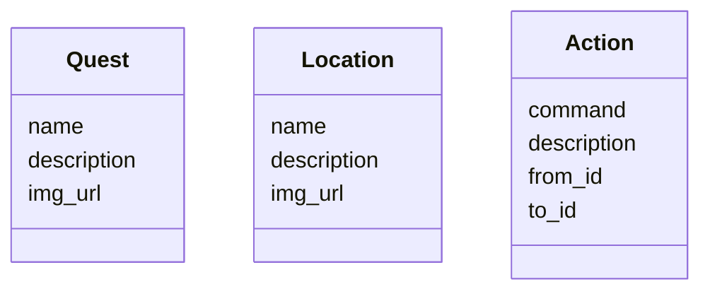
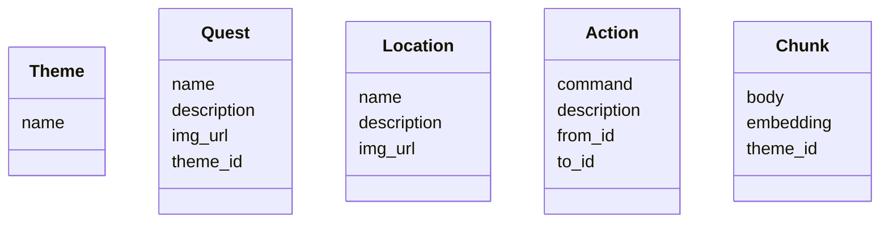

Simplified Datamodel for presentation

```mermaid
classDiagram
    class Quest {
        name <string>
        description <string>
        img_url <string>
    }
    class Location {
        name <string>
        description <string>
        img_url <string>
    }
    class Action {
        command <string>
        description <string>
        from_id <id>
        to_id <id>
    }
```

Model with Themes and Chunks

```mermaid
classDiagram
    class Theme {
        name <string>
    }
    class Quest {
        name <string>
        description <string>
        img_url <string>
        theme_id <id>
    }
    class Location {
        name <string>
        description <string>
        img_url <string>
    }
    class Action {
        command <string>
        description <string>
        from_id <id>
        to_id <id>
    }
    class Chunk {
        body <string>
        embedding <vector>
        theme_id <id>
    }


```